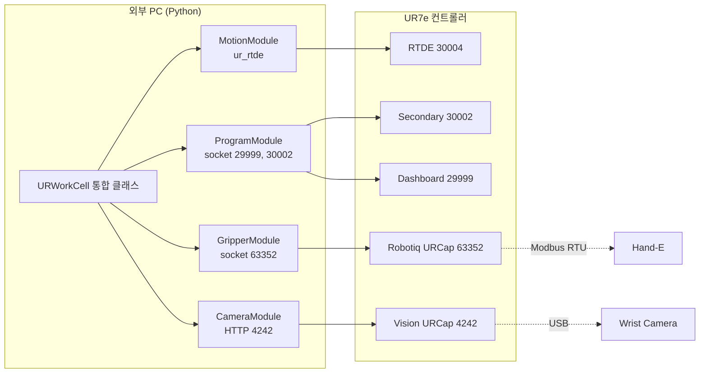
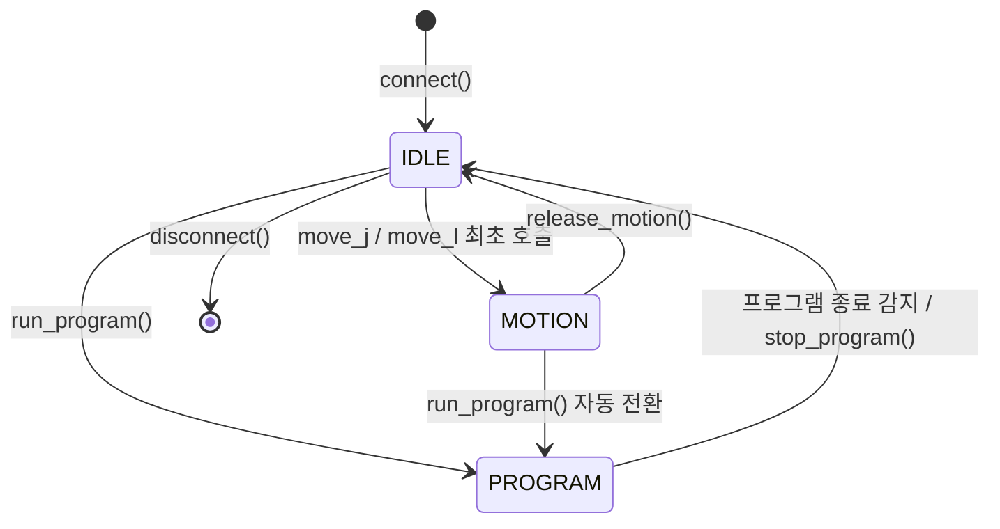
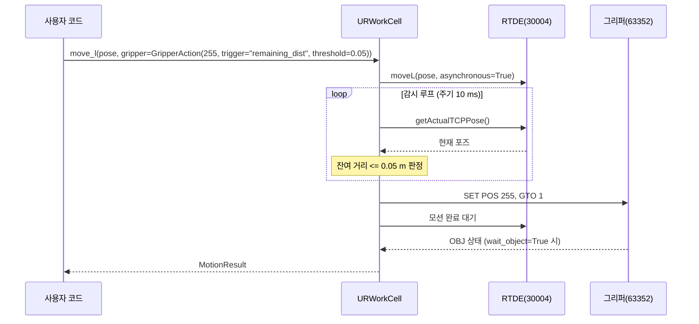

# UR7e 통합 제어 클래스 개발사양서

| 항목 | 내용 |
|---|---|
| 문서 버전 | 1.0 |
| 작성일 | 2026-08-13 |
| 대상 시스템 | UR7e (PolyScope X), Robotiq Hand-E, Robotiq Wrist Camera |
| 개발 언어 | Python 3.10 이상 |
| 핵심 의존성 | ur_rtde, requests, opencv-python, numpy |

---

## 1. 개요

### 1.1 목적

UR7e 로봇의 모션 제어, Robotiq Hand-E 그리퍼 제어, Robotiq Wrist Camera 영상 취득, 컨트롤러 저장 프로그램 실행의 4개 기능을 단일 클래스 `URWorkCell`로 통합한다. 특히 MoveJ, MoveL 모션 명령 호출 시 그리퍼 동작을 하나의 인자로 함께 지정하여, 이동과 파지를 한 번의 호출로 수행하는 것을 핵심 요구사항으로 한다.

### 1.2 범위

본 사양서는 클래스 인터페이스, 동시 실행 설계, 상태 모델, 예외 처리, 제약 사항, 테스트 항목을 정의한다. Cam Locate 검출 좌표 연동 등 비전 기반 픽킹 로직은 차기 버전 범위로 한다.

### 1.3 용어

| 용어 | 정의 |
|---|---|
| RTDE | Real-Time Data Exchange. UR 컨트롤러의 실시간 데이터 교환 프로토콜, 포트 30004 |
| URCap | UR 티치펜던트에 설치되는 플러그인 소프트웨어 |
| External Control URCap | 외부 PC의 ur_rtde 명령을 수신하는 PolyScope X용 URCap |
| Dashboard Server | 프로그램 로드, 실행 등 상위 제어용 텍스트 명령 서버, 포트 29999 |
| Cam Locate | Wrist Camera URCap의 물체 검출 프로그램 노드 |
| TCP | Tool Center Point. 로봇 공구 기준점. 통신 프로토콜 TCP/IP와 구분하여 표기 |

---

## 2. 시스템 구성

### 2.1 통신 인터페이스

| 연번 | 대상 | 프로토콜 | 포트 | 용도 |
|---|---|---|---|---|
| 1 | 로봇 모션 | RTDE | 30004 | MoveJ, MoveL, 상태 수신 |
| 2 | 로봇 스크립트 | Secondary Client Interface | 30002 | URScript 원문 전송 |
| 3 | 로봇 상위 제어 | Dashboard Server | 29999 | 저장 프로그램 load, play, stop |
| 4 | Hand-E 그리퍼 | Robotiq URCap 소켓 서버 | 63352 | GET, SET ASCII 명령 |
| 5 | Wrist Camera | HTTP | 4242 | current.jpg 이미지 취득 |

### 2.2 아키텍처



### 2.3 실행 모드 상태 모델

RTDE 외부 제어와 컨트롤러 저장 프로그램은 동시에 실행될 수 없다. 클래스는 내부적으로 다음 3개 모드를 관리하며, 모드 전환 시 필요한 연결 해제와 재수립을 자동으로 수행한다.

| 모드 | 설명 | 허용 기능 |
|---|---|---|
| IDLE | 초기 상태, 연결만 유지 | 상태 조회, 카메라, 그리퍼 |
| MOTION | RTDE 제어 활성 | move_j, move_l, 그리퍼, 카메라 |
| PROGRAM | 저장 프로그램 실행 중 | 프로그램 제어, 카메라 (그리퍼는 프로그램이 점유할 수 있음) |



---

## 3. 클래스 설계

### 3.1 클래스 구성

| 클래스 | 책임 |
|---|---|
| URWorkCell | 외부 공개 API, 모드 관리, 모션과 그리퍼 동기화 |
| GripperAction | 모션에 첨부하는 그리퍼 동작 정의 데이터 클래스 |
| _MotionModule | ur_rtde RTDEControl, RTDEReceive 래핑 (내부) |
| _GripperModule | 포트 63352 소켓 통신 (내부) |
| _CameraModule | 포트 4242 HTTP 이미지 취득 (내부) |
| _ProgramModule | Dashboard 29999, ScriptSender 30002 (내부) |

### 3.2 생성자

```python
URWorkCell(
    robot_ip: str,
    rtde_frequency: float = 500.0,     # RTDE 통신 주기 [Hz], 최대 500
    use_ext_urcap: bool = True,        # PolyScope X External Control URCap
    polyscope_x: bool = True,          # Dashboard 파일명 규칙 선택
    gripper_enabled: bool = True,
    camera_enabled: bool = True,
    connect_timeout: float = 5.0       # 각 인터페이스 접속 타임아웃 [s]
)
```

context manager를 지원한다. `with URWorkCell(ip) as cell:` 블록 종료 시 모든 연결을 해제한다.

---

## 4. API 사양

### 4.1 생명주기

| 메서드 | 인자 | 반환 | 설명 |
|---|---|---|---|
| connect() | 없음 | None | 활성화된 모듈 전체 접속. 실패 모듈은 ConnectionReport에 기록 |
| disconnect() | 없음 | None | 전체 연결 해제, 진행 중 모션 정지 |
| get_connection_report() | 없음 | dict | 모듈별 접속 상태 {"motion": bool, "gripper": bool, "camera": bool, "dashboard": bool} |

### 4.2 GripperAction 데이터 클래스

모션 명령에 첨부하는 그리퍼 동작 1건을 정의한다.

```python
@dataclass
class GripperAction:
    position: int                 # 목표 위치 0(열림) ~ 255(닫힘)
    speed: int = 255              # 속도 0 ~ 255
    force: int = 128              # 파지력 0 ~ 255
    trigger: str = "start"        # 트리거 모드, 4.4절 참조
    threshold: float = 0.0        # 트리거 판정 임계값
    wait_object: bool = False     # True이면 OBJ 판정까지 대기 후 결과 반환
```

편의 생성자 `GripperAction.open()`, `GripperAction.close()`를 제공한다.

### 4.3 모션 API

| 메서드 | 주요 인자 | 단위 | 반환 |
|---|---|---|---|
| move_j(q, speed, accel, gripper=None, blocking=True) | q: 관절 6개 | rad, rad/s, rad/s^2 | MotionResult |
| move_l(pose, speed, accel, gripper=None, blocking=True) | pose: TCP 6요소 | m, rad, m/s, m/s^2 | MotionResult |
| move_j_ik(pose, speed, accel, gripper=None) | pose: TCP 6요소 | 상동 | MotionResult |
| stop(decel=2.0) | 감속도 | rad/s^2 | None |

기본값: move_j는 speed 1.05 rad/s, accel 1.4 rad/s^2. move_l은 speed 0.25 m/s, accel 1.2 m/s^2.

MotionResult 구성:

| 필드 | 형 | 내용 |
|---|---|---|
| motion_ok | bool | 모션 정상 완료 여부 |
| gripper_pos | int 또는 None | 그리퍼 최종 위치 |
| gripper_obj | int 또는 None | OBJ 상태 0~3, 1 또는 2이면 물체 감지 |
| elapsed | float | 소요 시간 [s] |

### 4.4 모션과 그리퍼 동시 실행 (핵심 기능)

gripper 인자에 GripperAction을 전달하면 모션과 그리퍼가 하나의 호출로 실행된다. 내부적으로 모션은 ur_rtde의 asynchronous=True로 시작하고, 별도 트리거 감시 루프가 그리퍼 명령 시점을 판정한다.

트리거 모드:

| trigger 값 | 그리퍼 명령 시점 | threshold 의미 | 대표 용례 |
|---|---|---|---|
| "start" | 모션 시작과 동시 | 사용 안 함 | 이동하며 미리 열기 |
| "end" | 모션 완료 직후 | 사용 안 함 | 도착 후 파지 |
| "time" | 모션 시작 후 threshold 초 경과 | 지연 시간 [s] | 타이밍 기반 동작 |
| "remaining_dist" | 목표까지 잔여 TCP 거리가 threshold 이하 | 거리 [m] | 접근 중 미리 닫기 시작 |
| "remaining_joint" | 목표까지 잔여 관절 거리(노름)가 threshold 이하 | 각도 [rad] | move_j에서 근접 판정 |

동작 시퀀스 (trigger="remaining_dist" 예):



동시 실행 규정:

1. 감시 루프 판정 주기는 10 ms로 한다. rtde_frequency 500 Hz 기준 5 사이클에 해당한다.
2. blocking=True(기본)일 때 move 계열 호출은 모션 완료와 그리퍼 명령 발행이 모두 끝난 뒤 반환한다. wait_object=True이면 그리퍼 OBJ 판정까지 대기한다.
3. blocking=False일 때 즉시 반환하며, wait_motion_done(timeout)으로 완료를 대기할 수 있다. 이 경우 트리거 감시는 내부 스레드가 수행한다.
4. 그리퍼 통신 실패 시 모션은 계속 진행하고, MotionResult에 실패를 기록한다. 모션을 함께 중단해야 하는 공정은 abort_motion_on_gripper_fault=True 옵션을 사용한다.
5. 안전 규정: trigger="start" 또는 "time"으로 닫힘 동작을 지정할 때, 로봇 이동 경로와 파지 대상의 간섭 여부는 사용자 책임으로 한다. 사양서는 소프트웨어 동작만 보증한다.

### 4.5 그리퍼 단독 API

| 메서드 | 인자 | 반환 |
|---|---|---|
| gripper_activate() | 없음 | None, 최초 1회 필요 |
| gripper_move(position, speed=255, force=128, wait=True) | 0~255 | (pos, obj) |
| gripper_open() / gripper_close() | speed, force, wait | (pos, obj) |
| gripper_position() | 없음 | int 0~255 |
| gripper_object_detected() | 없음 | bool |

### 4.6 카메라 API

| 메서드 | 인자 | 반환 | 비고 |
|---|---|---|---|
| camera_frame(image_type="color") | color, edges, magnitude, annotations | numpy BGR 배열 또는 None | HTTP GET 1회 |
| camera_snapshot(path, image_type="color") | 저장 경로 | bool | |
| camera_live(image_type, poll_interval=0.2) | 폴링 주기 [s] | None, q 키 종료 | 0.1 s 미만 금지 |
| camera_ok() | 없음 | bool | 포트 4242 응답 확인 |

제약: 로봇 프로그램 실행 중에는 마지막 Cam Locate 처리 이미지가 반환된다. 5 megapixel 원본 해상도는 제공되지 않는다.

### 4.7 저장 프로그램 API

| 메서드 | 인자 | 반환 | 비고 |
|---|---|---|---|
| run_program(name, wait_until_done=False) | 프로그램 이름 | None | PolyScope X는 확장자 없이, PolyScope 5는 .urp 포함 규칙을 자동 적용 |
| stop_program() / pause_program() | 없음 | None | |
| program_running() | 없음 | bool | |
| loaded_program() | 없음 | str | |
| send_script_file(path) | PC의 .script 파일 경로 | None | 포트 30002 전송 |

run_program 호출 시 MOTION 모드였다면 RTDE 제어 스크립트를 정지하고 PROGRAM 모드로 자동 전환한다. 전환 소요 시간은 최대 2 s를 목표로 한다.

### 4.8 상태 조회 API

| 메서드 | 반환 | 단위 |
|---|---|---|
| joints() | 관절 각도 6개 | rad |
| tcp_pose() | TCP 포즈 6요소 | m, rad |
| tcp_force() | 힘, 토크 6요소 | N, Nm |
| is_steady() | bool | |
| mode() | "IDLE", "MOTION", "PROGRAM" | |

---

## 5. 동시 실행 설계

| 항목 | 규정 |
|---|---|
| 스레드 구성 | 메인 스레드(사용자 호출), 트리거 감시 스레드(모션당 1개, 종료 시 소멸), 카메라는 요청 시 동기 처리 |
| 그리퍼 소켓 동시성 | threading.Lock으로 명령 직렬화, 명령당 왕복 1회 |
| RTDE 수신 | RTDEReceiveInterface는 트리거 감시와 상태 조회가 공유, ur_rtde 내부 스레드 안전성에 의존 |
| 재접속 | 모션, 그리퍼 소켓 끊김 감지 시 1회 자동 재접속 시도 후 실패하면 예외 |
| 타임아웃 기본값 | 접속 5 s, 그리퍼 응답 2 s, 카메라 HTTP 3 s, Dashboard 응답 5 s |

---

## 6. 예외 및 에러 처리

모든 예외는 `WorkCellError`를 기반 클래스로 한다.

| 예외 클래스 | 발생 조건 | 에러 코드 |
|---|---|---|
| ConnectionFailedError | 접속 실패, 재접속 실패 | E100 |
| MotionError | moveJ, moveL 거부 또는 실행 실패 | E200 |
| ProtectiveStopError | 보호 정지 감지 | E201 |
| GripperError | 그리퍼 ack 미수신, FLT 코드 0 이외 | E300 |
| GripperNotActivatedError | 활성화 전 이동 명령 | E301 |
| CameraError | HTTP 4242 무응답 또는 디코드 실패 | E400 |
| ProgramError | load, play 실패, File not found | E500 |
| ModeConflictError | 모드 규칙 위반 호출 | E600 |

공통 규정: 예외 메시지에 에러 코드, 대상 인터페이스, 원인 응답 문자열을 포함한다. 보호 정지 등 안전 관련 상태는 폴링으로 감지하여 진행 중 blocking 호출을 즉시 예외로 중단한다.

---

## 7. 제약 사항

1. RTDE 외부 제어와 컨트롤러 저장 프로그램은 동시 실행 불가. 모드 전환으로만 병행한다.
2. Wrist Camera 포트 4242 경로는 PolyScope 5 세대 Vision URCap에서 검증된 비공식 경로다. PolyScope X용 URCap에서 상이할 수 있으므로 connect() 시 camera_ok()를 검사하고 실패해도 다른 기능은 정상 동작하도록 한다.
3. 그리퍼 포트 63352는 Robotiq URCap 실행 중에만 열린다. 저장 프로그램이 그리퍼를 점유하는 동안 외부 명령과 충돌할 수 있으므로 PROGRAM 모드에서는 그리퍼 단독 API 사용을 권장하지 않는다.
4. 트리거 판정 정밀도는 감시 주기 10 ms와 로봇 속도의 곱으로 제한된다. 예: TCP 속도 0.25 m/s에서 최대 2.5 mm 판정 오차.

---

## 8. 테스트 항목

| 번호 | 항목 | 합격 기준 |
|---|---|---|
| T01 | 4개 인터페이스 접속, 해제 | 예외 없이 완료, report 전 항목 True |
| T02 | move_j, move_l 단독 | 목표 도달 오차 관절 0.001 rad, TCP 0.5 mm 이내 |
| T03 | gripper=start 동시 실행 | 모션 시작 후 50 ms 이내 그리퍼 명령 발행 |
| T04 | gripper=remaining_dist | threshold 판정 오차 4항 계산값 이내 |
| T05 | gripper=end | 모션 완료 후 50 ms 이내 그리퍼 명령 발행 |
| T06 | wait_object 파지 판정 | 물체 유무에 따라 OBJ 1, 2와 3 구분 |
| T07 | 프로그램 실행 및 모드 전환 | MOTION에서 run_program 후 2 s 이내 실행 시작 |
| T08 | 카메라 4종 이미지 취득 | 각 type별 정상 디코드 |
| T09 | 그리퍼 통신 차단 내성 | 모션 지속, MotionResult에 실패 기록 |
| T10 | 보호 정지 처리 | ProtectiveStopError 발생, 후속 명령 차단 |

---

## 9. 사용 예시

```python
from ur_workcell import URWorkCell, GripperAction

with URWorkCell("192.168.0.100") as cell:
    cell.gripper_activate()

    # 이동하면서 그리퍼를 미리 연다
    cell.move_j(home_q, gripper=GripperAction.open(trigger="start"))

    # 접근 중 잔여 거리 50 mm 시점부터 닫기 시작, 파지 판정까지 대기
    result = cell.move_l(
        pick_pose, speed=0.1,
        gripper=GripperAction(position=255, force=100,
                              trigger="remaining_dist", threshold=0.05,
                              wait_object=True))
    if result.gripper_obj in (1, 2):
        cell.move_l(place_pose, gripper=GripperAction.open(trigger="end"))

    cell.camera_snapshot("after_place.jpg", "color")
    cell.run_program("quality_check", wait_until_done=True)
```
